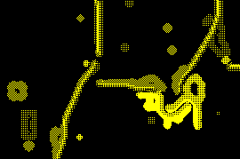

# Neural Cellular Automata
GPU-accelerated, fully parameterized neural cellular automata implemented on pure JavaScript using [GPU.js](https://gpu.rocks).

# Growing neural CAs
If you know [Conway's Game of Life](https://en.wikipedia.org/wiki/Conway%27s_Game_of_Life), then you may be somewhat familiar with basic cellullar automata. Cells on a grid have a binary state of 0 or 1 representing wether they are alive (1) or dead (0) at any precise instant, which can change depending on the state of other cells in the neighborhood. 

Here the same fundamentals apply, but some twists give our cells some more complexity to work with: Their states are any value in the range from 0.0 to 1.0, which is represented graphically with different shades of color, and a small 3x3 kernel matrix is used when checking the surrounding cell's states, changing how their position influences their neighbors.

On top of that, an activation function is applied over each cell's state, which can be modified and tweaked from the web interface since it's written in plain JavaScript.

With all this, simple neural cellular automata can be run that have the potential to produce rather complex behavior. A small set of interesting and/or visually appealing presets are included to toy around and experiment with! 🐈

# Give it a go!
Check it live on this project's [github pages site](https://luisboto.github.io/NeuralCellularAutomata/).

## Also check
* [GPU.js](https://github.com/gpujs/gpu.js), a wonderful JavaScript library to perform GPU-accelerated computation.
* [Neuralpatterns.io](https://neuralpatterns.io), a website by [Max Robinson](https://github.com/MaxRobinsonTheGreat/NeuralPatterns) and the main inspiration for this implementation.
* Max's channel [Emergent Garden](https://www.youtube.com/@EmergentGarden/videos) on YouTube, for some interesting videos on the topic.
* [Growing Neural Cellular Automata](https://distill.pub/2020/growing-ca/), an article on training and running complex neural CAs to replicate 2d images, with live demos.

